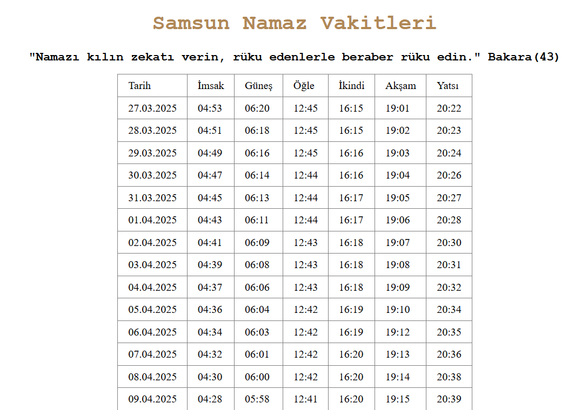

# Samsun Prayer Times (Static + Serverless)

A simple **HTML/CSS/JS** interface with a **Vercel Serverless Function** acting as a proxy for prayer times.

## 👀 Live Demo

- **Frontend:** `/`
- **API:** `/api/namazvakitleri?ilce=9819`

## 🧱 Project Structure

- / ← repository root
- api/
- namazvakitleri.js # Serverless API (Vercel)
- public/ # (if index.html is here, Output=public)
- index.html
- style.css
- api_request.js
- vercel.json (optional)

---

> You can move `index.html` to the root if you want (Output `.`). Logic remains the same.

## ✅ Requirements

- Node **18+**
- Vercel CLI (to simulate the Vercel environment locally)

## 🏃‍♂️ Run Locally

````bash
# 1) Clone the repo
git clone https://github.com/<username>/<repo>.git
cd <repo>

# 2) Install Vercel CLI & log in
npm i -g vercel
vercel login

# 3) Local development (serves both static files and /api)
vercel dev

# 4) Browser
# http://localhost:3000
# http://localhost:3000/api/namazvakitleri?ilce=9819


## 🛠 Installation & Usage

Make sure you have [Node.js](https://nodejs.org) installed.

### 1. Clone the repository:

```bash
git clone https://github.com/halukerenozlu/WebPrayerCalendar.git
cd WebPrayerCalendar
````

## Manual via CLI:

- `vercel` # preview
- `vercel --prod` # production

## API Reference

- API: ezanvakti.emushaf.net
- City ID: 9819 corresponds to Samsun
- `GET /api/namazvakitleri?ilce=9819`

## 🧩 Customization Tips

- District parameter: Change ?ilce=XXXX in the URL.

- Cache: API response includes s-maxage=300, stale-while-revalidate=60 for Vercel Edge caching.

- Timeout: 8-second timeout using AbortController for slow upstream API.

## 🛠 Troubleshooting

- 404 (no /api locally): Run vercel dev in the repo root and make sure the api/ folder is also in the root.

- Dashboard says “No Production Deployment”: Run vercel --prod or push to main.

- Blank page: Use relative paths (style.css, api_request.js), avoid starting with /.

- Deprecation warnings (local): Comes from a package; can be ignored or silenced with NODE_OPTIONS="--no-deprecation".

## 📸 Preview


